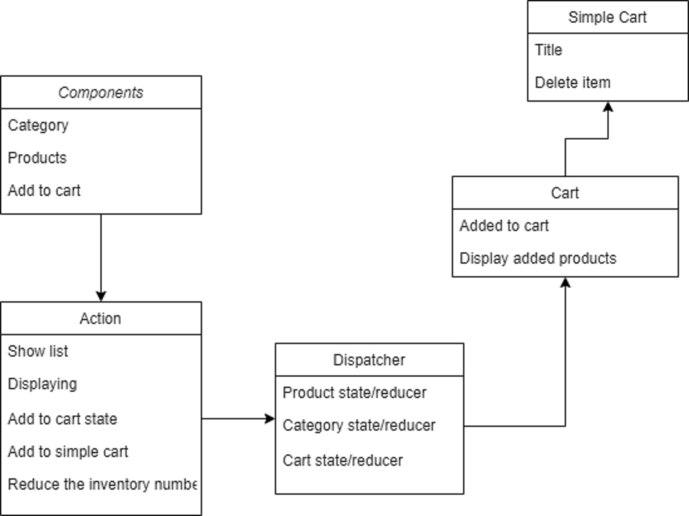

# Our Store

Its an app for store called storefront
## Available Scripts

In the project directory, you can run:

### `npm start`

### `npm test`

## UML : 

### Deployment
- netlify:  
- pull request: https://github.com/Nedal1994/storefront/pull/4
